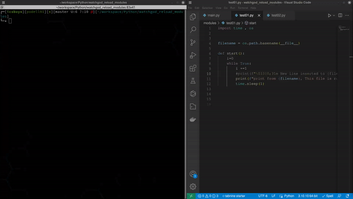

# Using Watchgod Module for watching file changes and restart modules

This is a simple example of using watchgod module for watching file changes inside project directory and restart all loaded modules.

## Features

- watch for file changes in project directory
- restart all loaded modules


## Installation

To install the dependencies for this project, run the following command:

```sh
pip install -r requirements.txt
```
```sh
python main.py
```

# Usage

Once the main.py is running you can modify modules file inside modules directory and watchgod will restart all loaded modules



## Special Thanks

This project was inspired by the Twitch channel of [Prof. Andrea Pollini](https://www.twitch.tv/profandreapollini) and the supportive Twitch community. Thanks to their encouragement and feedback, this bot was created to enhance the Twitch chat experience. Special thanks also go to the developers of Pygame and gTTS for their excellent libraries. 


## License

This project is licensed under the MIT License - see the [LICENSE](https://www.mit.edu/~amini/LICENSE.md) for details.
